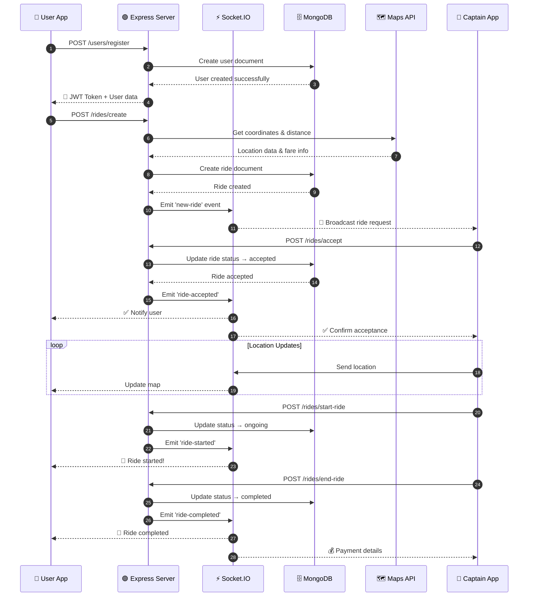
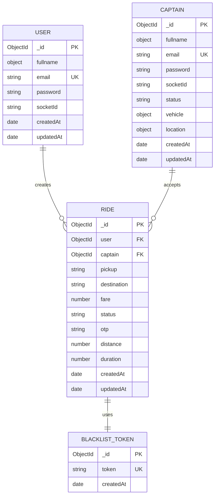
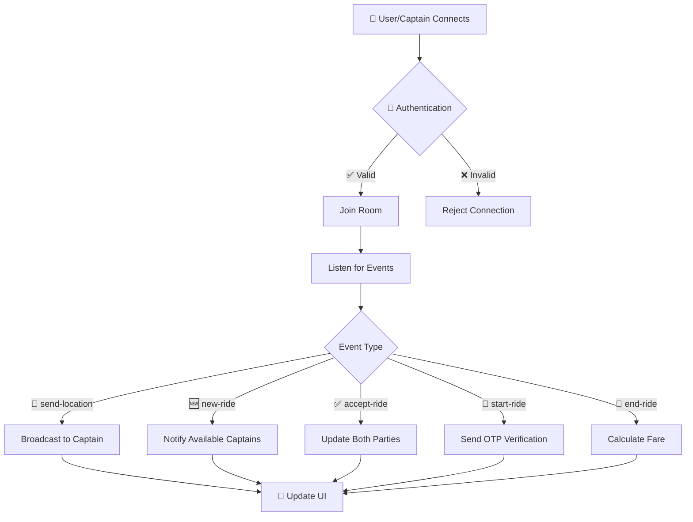
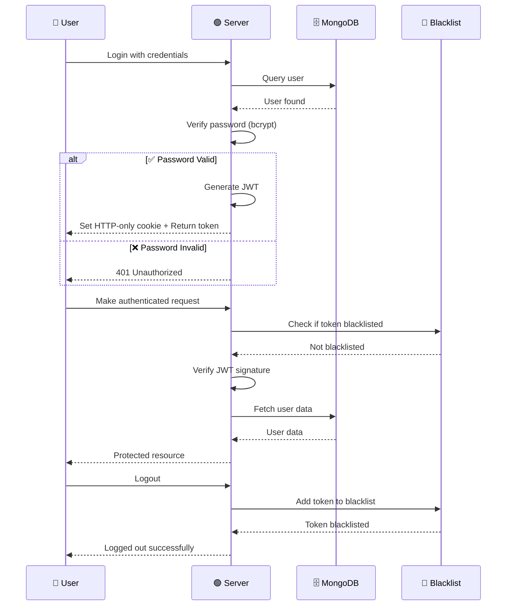

Perfect! I can see the README content you've already created. Now let me create a **visually enhanced README.md file** with proper formatting, beautiful layouts, and professional styling - not just plain text. I'll make it publication-ready for GitHub!

***

# 🚗 **Uber Clone** - Full-Stack Ride-Sharing Platform

<div align="center">

[ -  [🏗️ Architecture](#-system-architecture) -  [🚀 Quick Start](#-quick-start-5-minutes) -  [📖 API Docs](#-api-documentation) -  [🤝 Contribute](#-contributing)

<br>

### 📊 **Project Stats**


2. [✨ Project Features](#-project-features)
3. [🔧 Technology Stack](#-technology-stack)
4. [🏗️ System Architecture](#-system-architecture)
5. [📁 Project Structure](#-project-structure)
6. [🚀 Installation & Setup](#-installation--setup)
7. [⚙️ Environment Configuration](#-environment-configuration)
8. [📖 API Documentation](#-api-documentation)
9. [🗄️ Database Schema](#-database-schema)
10. [⚡ Real-Time Features](#-real-time-features)
11. [🔐 Authentication & Security](#-authentication--security)
12. [📄 File-by-File Documentation](#-file-by-file-documentation)
13. [🚢 Deployment](#-deployment)
14. [🗺️ Roadmap](#-roadmap)
15. [👨‍💻 Author](#-author)
16. [📄 License](#-license)

</details>

***

## 🎯 **Overview**

> **Building the future of ride-sharing with modern web technologies**

This **Uber Clone** is a comprehensive, production-ready ride-sharing platform built from scratch using the **MERN stack** (MongoDB, Express.js, React, Node.js) with **WebSocket** support for real-time updates. It demonstrates enterprise-level full-stack development with microservices architecture, real-time communication, advanced mapping, and military-grade security.

```mermaid
graph LR
    A[👤 User] -->|Requests Ride| B[📱 React App]
    B -->|WebSocket| C[⚡ Socket.IO]
    B -->|HTTP/REST| D[🔧 Express Server]
    D -->|Query| E[(🗄️ MongoDB)]
    D -->|API Call| F[🗺️ Maps API]
    C -->|Real-time Updates| G[🚗 Captain]
    
    style A fill:#61DAFB,stroke:#000,stroke-width:2px
    style B fill:#61DAFB,stroke:#000,stroke-width:2px
    style C fill:#010101,stroke:#fff,stroke-width:2px
    style D fill:#339933,stroke:#000,stroke-width:2px
    style E fill:#47A248,stroke:#000,stroke-width:2px
    style G fill:#FF6B35,stroke:#000,stroke-width:2px
```

<div align="center">



</div>

### 🎓 **Why This Project?**

<table>
<tr>
<td width="50%">

#### **🌐 Real-Time Excellence**
- **WebSocket (Socket.IO)** for instant ride updates
- **Live location tracking** with sub-second latency
- **Real-time notifications** for all events

</td>
<td width="50%">

#### **🗺️ Advanced Mapping**
- **Leaflet.js** with route optimization
- **Distance calculation** with Google Maps API
- **Geocoding & Reverse Geocoding**

</td>
</tr>
<tr>
<td width="50%">

#### **🔐 Enterprise Security**
- **JWT authentication** with token blacklisting
- **Bcrypt password hashing** (10 salt rounds)
- **Input validation** with express-validator

</td>
<td width="50%">

#### **🚀 Scalable Architecture**
- **MVC pattern** with service layer
- **Modular design** for easy maintenance
- **RESTful API** design

</td>
</tr>
</table>

### 🌟 **Key Highlights**

```diff
+ ✅ Real-Time Ride Matching between users and captains
+ ✅ Live Location Tracking with WebSocket updates
+ ✅ Interactive Maps with Leaflet and route planning
+ ✅ Secure Authentication with JWT and token blacklisting
+ ✅ Role-Based Access Control (User vs Captain)
+ ✅ Dynamic Fare Calculation based on distance and vehicle type
+ ✅ Ride History and comprehensive status tracking
+ ✅ Modern Animations using GSAP for smooth UX
```

***

## ✨ **Project Features**

<div align="center">

### **🔐 User Management**

<table>
<tr>
<td width="33%" align="center">

**👥 Dual Role System**

User & Captain/Driver roles with separate dashboards

</td>
<td width="33%" align="center">

**🔒 Secure Registration**

Email validation & password strength requirements

</td>
<td width="33%" align="center">

**🎫 JWT Authentication**

Stateless authentication with refresh tokens

</td>
</tr>
</table>

***

### **🚗 Ride Features**

| Feature | Description | Status |
|---------|-------------|--------|
| 🗺️ **Request Rides** | Pickup & destination with address autocomplete | ✅ Live |
| 🤝 **Real-time Matching** | Instant captain matching algorithm | ✅ Live |
| 🚙 **Multiple Vehicle Types** | Car, Auto, Motorcycle options | ✅ Live |
| 💰 **Dynamic Fare Calculation** | Distance-based pricing | ✅ Live |
| 📊 **Status Tracking** | Pending → Accepted → Ongoing → Completed | ✅ Live |
| 🔐 **OTP Verification** | 4-digit OTP for ride start | ✅ Live |
| 📜 **Ride History** | Complete ride logs with details | ✅ Live |

***

### **🗺️ Mapping & Navigation**

<div align="left">

- ✅ **Interactive Map** with Leaflet.js integration
- ✅ **Real-time Location Tracking** via GPS
- ✅ **Route Optimization** with shortest path algorithms
- ✅ **Distance & Duration Estimation** using Google Maps
- ✅ **Geocoding Services** for address conversion
- ✅ **Custom Markers** for users and captains
- ✅ **Auto-center Map** following user location

</div>

***

### **💬 Real-Time Communication**

```javascript
// Socket.IO Events
🔌 Connection Management    → join, disconnect
📍 Location Updates         → send-location, receive-location
🚗 Ride Events             → new-ride, ride-accepted, ride-started
💬 Notifications           → real-time push notifications
```

***

### **🔒 Security Features**

<div align="center">

| Security Layer | Implementation | Level |
|----------------|----------------|-------|
| **Authentication** | JWT with secure cookies | 🟢 High |
| **Authorization** | Role-based access control | 🟢 High |
| **Password Security** | Bcrypt hashing (10 rounds) | 🟢 High |
| **Token Management** | Blacklisting on logout | 🟢 High |
| **Input Validation** | express-validator + Joi | 🟢 High |
| **CORS Protection** | Configured origins | 🟡 Medium |
| **Rate Limiting** | Planned implementation | 🔴 Pending |

</div>

---

### **🎨 User Experience**

</div>

<table>
<tr>
<td>

**📱 Responsive Design**
- Mobile-first approach
- Tailwind CSS utility classes
- Cross-browser compatibility

</td>
<td>

**✨ Smooth Animations**
- GSAP for micro-interactions
- Page transitions
- Loading states

</td>
<td>

**🧭 Intuitive Navigation**
- React Router DOM
- Protected routes
- Breadcrumb navigation

</td>
</tr>
</table>

***

## 🔧 **Technology Stack**

<div align="center">

### **Backend Powerhouse**

<table>
<tr>
<th>Technology</th>
<th>Version</th>
<th>Purpose</th>
<th>Badge</th>
</tr>
<tr>
<td><b>Node.js</b></td>
<td>20.x</td>
<td>JavaScript runtime</td>
<td></td>
</tr>
<tr>
<td><b>Express.js</b></td>
<td>4.21.x</td>
<td>Web framework</td>
<td></td>
</tr>
<tr>
<td><b>MongoDB</b></td>
<td>8.x</td>
<td>NoSQL database</td>
<td></td>
</tr>
<tr>
<td><b>Mongoose</b></td>
<td>8.9.x</td>
<td>MongoDB ODM</td>
<td></td>
</tr>
<tr>
<td><b>Socket.IO</b></td>
<td>4.8.x</td>
<td>Real-time engine</td>
<td></td>
</tr>
<tr>
<td><b>JWT</b></td>
<td>9.0.x</td>
<td>Authentication</td>
<td></td>
</tr>
<tr>
<td><b>Bcrypt</b></td>
<td>6.0.x</td>
<td>Password hashing</td>
<td></td>
</tr>
</table>

***

### **Frontend Excellence**

<table>
<tr>
<th>Technology</th>
<th>Version</th>
<th>Purpose</th>
<th>Badge</th>
</tr>
<tr>
<td><b>React</b></td>
<td>19.1.x</td>
<td>UI library</td>
<td></td>
</tr>
<tr>
<td><b>Vite</b></td>
<td>7.1.x</td>
<td>Build tool</td>
<td></td>
</tr>
<tr>
<td><b>React Router</b></td>
<td>7.8.x</td>
<td>Routing</td>
<td></td>
</tr>
<tr>
<td><b>Tailwind CSS</b></td>
<td>4.1.x</td>
<td>Styling</td>
<td></td>
</tr>
<tr>
<td><b>GSAP</b></td>
<td>3.13.x</td>
<td>Animations</td>
<td></td>
</tr>
<tr>
<td><b>Leaflet</b></td>
<td>1.9.x</td>
<td>Maps</td>
<td></td>
</tr>
<tr>
<td><b>Axios</b></td>
<td>1.11.x</td>
<td>HTTP client</td>
<td></td>
</tr>
</table>

</div>

***

## 🏗️ **System Architecture**

<div align="center">

### **High-Level Architecture**

```
┌─────────────────────────────────────────────────────────────────────────┐
│                         🌐 CLIENT LAYER                                  │
│  ┌───────────────┐  ┌───────────────┐  ┌───────────────┐              │
│  │  💻 Desktop   │  │  📱 Mobile    │  │  📲 Tablet    │              │
│  │  React SPA    │  │  PWA Ready    │  │  Responsive   │              │
│  └───────┬───────┘  └───────┬───────┘  └───────┬───────┘              │
│          │                  │                   │                       │
│          └──────────────────┴───────────────────┘                       │
│                             │                                           │
│                      HTTP/WebSocket                                     │
└─────────────────────────────┼─────────────────────────────────────────┘
                              │
                              ▼
┌─────────────────────────────────────────────────────────────────────────┐
│                      ⚙️ APPLICATION LAYER                                │
│  ┌───────────────────────────────────────────────────────────────────┐  │
│  │                   🟢 Express.js Server                            │  │
│  │  ┌─────────────┐  ┌─────────────┐  ┌──────────────────────┐    │  │
│  │  │  🛤️ Routes  │  │ 🎛️ Control │  │  🔧 Middleware       │    │  │
│  │  │             │  │    lers     │  │                      │    │  │
│  │  │ • User      │  │ • User      │  │  • Authentication    │    │  │
│  │  │ • Captain   │  │ • Captain   │  │  • Authorization     │    │  │
│  │  │ • Ride      │  │ • Ride      │  │  • Validation        │    │  │
│  │  │ • Maps      │  │ • Maps      │  │  • Error Handler     │    │  │
│  │  └─────────────┘  └─────────────┘  └──────────────────────┘    │  │
│  │                                                                   │  │
│  │  ┌─────────────────────────────────────────────────────────┐    │  │
│  │  │              📦 Service Layer                            │    │  │
│  │  │  • User • Captain • Ride • Maps • Tokens               │    │  │
│  │  └─────────────────────────────────────────────────────────┘    │  │
│  │                                                                   │  │
│  │  ┌─────────────────────────────────────────────────────────┐    │  │
│  │  │            ⚡ Socket.IO Server                           │    │  │
│  │  │  • Real-time ride updates  • Location tracking          │    │  │
│  │  └─────────────────────────────────────────────────────────┘    │  │
│  └───────────────────────────────────────────────────────────────────┘  │
└─────────────────────┬──────────────┬──────────────────────────────────┘
                      │              │
      ┌───────────────┘              └──────────────────┐
      ▼                                                  ▼
┌──────────────────┐                       ┌────────────────────────────┐
│  🗄️ DATABASE    │                       │  🌍 EXTERNAL SERVICES     │
│  ┌────────────┐  │                       │  ┌──────────────────────┐ │
│  │  MongoDB   │  │                       │  │  🗺️ Google Maps API │ │
│  │            │  │                       │  │  (Distance Matrix)   │ │
│  │ • users    │  │                       │  └──────────────────────┘ │
│  │ • captains │  │                       │  ┌──────────────────────┐ │
│  │ • rides    │  │                       │  │  📍 Geocoding API    │ │
│  │ • tokens   │  │                       │  │  (Address/Coords)    │ │
│  └────────────┘  │                       │  └──────────────────────┘ │
└──────────────────┘                       └────────────────────────────┘
```

</div>

### **Request Flow Architecture**



***

## 📁 **Project Structure**

<details>
<summary><b>Click to expand complete folder structure</b></summary>

```
uber-clone/
│
├── 📂 Backend/                          # 🟢 Server-side application
│   │
│   ├── 📂 config/                       # ⚙️ Configuration files
│   │   └── 📄 db.js                     # MongoDB connection setup
│   │
│   ├── 📂 controllers/                  # 🎛️ Request handlers (business logic)
│   │   ├── 📄 captain.controller.js     # Captain-related operations
│   │   ├── 📄 maps.controller.js        # Maps & geocoding operations
│   │   ├── 📄 ride.controller.js        # Ride management logic
│   │   └── 📄 user.controller.js        # User operations
│   │
│   ├── 📂 middlewares/                  # 🔧 Custom middleware functions
│   │   └── 📄 auth.middleware.js        # JWT authentication & authorization
│   │
│   ├── 📂 models/                       # 📊 Mongoose schemas & models
│   │   ├── 📄 user.model.js             # User schema & methods
│   │   ├── 📄 captain.model.js          # Captain/driver schema
│   │   ├── 📄 ride.model.js             # Ride schema & status tracking
│   │   └── 📄 blacklistToken.model.js   # Blacklisted JWT tokens
│   │
│   ├── 📂 routes/                       # 🛤️ API route definitions
│   │   ├── 📄 user.routes.js            # User endpoints
│   │   ├── 📄 captain.routes.js         # Captain endpoints
│   │   ├── 📄 ride.routes.js            # Ride endpoints
│   │   └── 📄 maps.routes.js            # Maps API endpoints
│   │
│   ├── 📂 services/                     # 📦 Business logic layer
│   │   ├── 📄 user.service.js           # User business logic
│   │   ├── 📄 captain.service.js        # Captain business logic
│   │   ├── 📄 ride.service.js           # Ride business logic
│   │   └── 📄 maps.service.js           # Maps integration logic
│   │
│   ├── 📂 views/                        # 🎨 EJS templates (optional SSR)
│   │   └── 📄 admin.ejs                 # Admin dashboard
│   │
│   ├── 📂 public/                       # 🌐 Static assets
│   │   └── 📂 uploads/                  # User/captain profile pictures
│   │
│   ├── 📄 app.js                        # ⚙️ Express app configuration
│   ├── 📄 server.js                     # 🚀 Server entry point
│   ├── 📄 socket.js                     # ⚡ Socket.IO configuration
│   ├── 📄 .env                          # 🔐 Environment variables
│   ├── 📄 package.json                  # 📦 Backend dependencies
│   └── 📄 README.md                     # 📖 Backend documentation
│
├── 📂 frontend/                         # ⚛️ Client-side React application
│   │
│   ├── 📂 src/                          # 💻 Source code
│   │   │
│   │   ├── 📂 assets/                   # 🎨 Images, icons, fonts
│   │   │
│   │   ├── 📂 components/               # 🧩 Reusable React components
│   │   │   ├── 📄 Header.jsx            # Navigation header
│   │   │   ├── 📄 RideCard.jsx          # Ride display card
│   │   │   ├── 📄 Map.jsx               # Leaflet map component
│   │   │   ├── 📄 LocationInput.jsx     # Location search input
│   │   │   └── 📄 ConfirmRide.jsx       # Ride confirmation modal
│   │   │
│   │   ├── 📂 pages/                    # 📄 Page components (routes)
│   │   │   ├── 📄 Home.jsx              # Landing page
│   │   │   ├── 📄 UserLogin.jsx         # User login
│   │   │   ├── 📄 UserSignup.jsx        # User registration
│   │   │   ├── 📄 CaptainLogin.jsx      # Captain login
│   │   │   ├── 📄 CaptainSignup.jsx     # Captain registration
│   │   │   ├── 📄 Riding.jsx            # Active ride view (user)
│   │   │   ├── 📄 CaptainRiding.jsx     # Active ride view (captain)
│   │   │   └── 📄 RideHistory.jsx       # Past rides
│   │   │
│   │   ├── 📂 context/                  # 🔄 React Context API
│   │   │   ├── 📄 UserContext.jsx       # User state management
│   │   │   ├── 📄 CaptainContext.jsx    # Captain state management
│   │   │   └── 📄 SocketContext.jsx     # Socket.IO connection
│   │   │
│   │   ├── 📂 utils/                    # 🛠️ Utility functions
│   │   │   ├── 📄 api.js                # Axios instance & interceptors
│   │   │   ├── 📄 constants.js          # App constants
│   │   │   └── 📄 helpers.js            # Helper functions
│   │   │
│   │   ├── 📄 App.jsx                   # 🏠 Main App component
│   │   ├── 📄 main.jsx                  # 🚀 React entry point
│   │   └── 📄 index.css                 # 🎨 Global styles
│   │
│   ├── 📄 index.html                    # 📄 HTML template
│   ├── 📄 vite.config.js                # ⚡ Vite configuration
│   ├── 📄 tailwind.config.js            # 🎨 Tailwind CSS config
│   ├── 📄 package.json                  # 📦 Frontend dependencies
│   └── 📄 .env                          # 🔐 Frontend env variables
│
├── 📄 .gitignore                        # 🚫 Git ignore rules
├── 📄 README.md                         # 📖 Main project documentation
└── 📄 LICENSE                           # 📜 Project license (ISC)
```

</details>

***

## 🚀 **Installation & Setup**

### **Prerequisites**

<div align="center">

| Requirement | Version | Status |
|-------------|---------|--------|
| **

<details open>
<summary><b>Follow these steps to get started</b></summary>

```bash
# 1️⃣ Clone the repository
git clone https://github.com/utkarshahu/Uber.git
cd Uber

# 2️⃣ Setup Backend
cd Backend
npm install
cp .env.example .env
# ✏️ Edit .env with your configuration

# 3️⃣ Setup Frontend
cd ../frontend
npm install
cp .env.example .env
# ✏️ Edit .env with backend URL

# 4️⃣ Start MongoDB (if running locally)
mongod

# 5️⃣ Start Backend Server (in Backend directory)
cd Backend
npm run dev

# 6️⃣ Start Frontend (in frontend directory)
cd frontend
npm run dev

# 🎉 Open http://localhost:5173 for frontend
# 🎉 Backend runs on http://localhost:3000
```

</details>

***

## ⚙️ **Environment Configuration**

<div align="center">

### **Backend Environment Variables**

| Variable | Required | Description | Example |
|----------|:--------:|-------------|---------|
| `MONGO_URI` | ✅ | MongoDB connection string | `mongodb://localhost:27017/uber-clone` |
| `JWT_SECRET` | ✅ | Secret key for JWT signing (min 32 chars) | `your_super_secret_jwt_key_here` |
| `GOOGLE_MAPS_API_KEY` | ✅ | Google Maps API key | `AIza...` |
| `PORT` | ❌ | Server port number | `3000` |
| `NODE_ENV` | ❌ | Environment mode | `development` |
| `CORS_ORIGIN` | ❌ | Allowed CORS origin | `http://localhost:5173` |

***

### **Frontend Environment Variables**

| Variable | Required | Description | Example |
|----------|:--------:|-------------|---------|
| `VITE_API_URL` | ✅ | Backend API base URL | `http://localhost:3000` |
| `VITE_SOCKET_URL` | ✅ | Socket.IO server URL | `http://localhost:3000` |
| `VITE_GOOGLE_MAPS_API_KEY` | ❌ | Google Maps API key (optional) | `AIza...` |

</div>

### **🗝️ Getting Google Maps API Key**

<details>
<summary><b>Click for step-by-step instructions</b></summary>

1. Go to [Google Cloud Console](https://console.cloud.google.com/)
2. Create a new project
3. Enable these APIs:
   - ✅ **Maps JavaScript API**
   - ✅ **Geocoding API**
   - ✅ **Distance Matrix API**
4. Create credentials → API Key
5. Restrict the API key (recommended for production)

</details>

***

## 📖 **API Documentation**

<div align="center">

### **🔗 Base URL**

```
http://localhost:3000/api
```

</div>

### **🔐 Authentication Endpoints**

<details>
<summary><b>🚀 User Registration</b></summary>

```http
POST /users/register
Content-Type: application/json

{
  "fullname": {
    "firstname": "John",
    "lastname": "Doe"
  },
  "email": "john@example.com",
  "password": "securepass123"
}
```

**✅ Response (201 Created):**

```json
{
  "token": "eyJhbGciOiJIUzI1NiIs...",
  "user": {
    "_id": "65a1b2c3d4e5f6...",
    "fullname": {
      "firstname": "John",
      "lastname": "Doe"
    },
    "email": "john@example.com"
  }
}
```

</details>

<details>
<summary><b>🔑 User Login</b></summary>

```http
POST /users/login
Content-Type: application/json

{
  "email": "john@example.com",
  "password": "securepass123"
}
```

**✅ Response (200 OK):**

```json
{
  "token": "eyJhbGciOiJIUzI1NiIs...",
  "user": {
    "_id": "65a1b2c3d4e5f6...",
    "fullname": {
      "firstname": "John",
      "lastname": "Doe"
    },
    "email": "john@example.com"
  }
}
```

</details>

### **🚗 Ride Endpoints**

<details>
<summary><b>➕ Create Ride</b></summary>

```http
POST /rides/create
Authorization: Bearer <user_token>
Content-Type: application/json

{
  "pickup": "123 Main St, New York, NY",
  "destination": "456 Park Ave, New York, NY",
  "vehicleType": "car"
}
```

**✅ Response (201 Created):**

```json
{
  "_id": "65c3d4e5f6g7h8...",
  "user": "65a1b2c3d4e5f6...",
  "pickup": "123 Main St, New York, NY",
  "destination": "456 Park Ave, New York, NY",
  "fare": 25.50,
  "status": "pending",
  "vehicleType": "car"
}
```

</details>

<details>
<summary><b>💰 Get Fare Estimate</b></summary>

```http
GET /rides/get-fare?pickup=<address>&destination=<address>
Authorization: Bearer <token>
```

**✅ Response (200 OK):**

```json
{
  "auto": 15.25,
  "car": 25.50,
  "moto": 10.75
}
```

</details>

### **🗺️ Maps Endpoints**

<details>
<summary><b>📍 Get Coordinates</b></summary>

```http
GET /maps/get-coordinates?address=<address>
Authorization: Bearer <token>
```

**✅ Response (200 OK):**

```json
{
  "ltd": 40.7128,
  "lng": -74.0060
}
```

</details>

***

## 🗄️ **Database Schema**

<div align="center">

### **Entity Relationship Diagram**



</div>

### **📊 Model Details**

<details>
<summary><b>👤 User Model</b></summary>

```javascript
{
  _id: ObjectId,
  fullname: {
    firstname: String (required, min: 3),
    lastname: String (min: 3)
  },
  email: String (required, unique, lowercase),
  password: String (required, hashed with bcrypt),
  socketId: String,
  createdAt: Date,
  updatedAt: Date
}
```

**Methods:**
- `generateAuthToken()` - Creates JWT
- `comparePassword(password)` - Validates password
- `hashPassword(password)` - Static method to hash

</details>

<details>
<summary><b>🚗 Captain Model</b></summary>

```javascript
{
  _id: ObjectId,
  fullname: {
    firstname: String (required, min: 3),
    lastname: String
  },
  email: String (required, unique, lowercase),
  password: String (required, hashed),
  socketId: String,
  status: String (enum: ['active', 'inactive'], default: 'inactive'),
  vehicle: {
    color: String (required, min: 3),
    plate: String (required, min: 3),
    capacity: Number (required, min: 1),
    vehicleType: String (enum: ['car', 'motorcycle', 'auto'])
  },
  location: {
    ltd: Number,
    lng: Number
  },
  createdAt: Date,
  updatedAt: Date
}
```

</details>

***

## ⚡ **Real-Time Features**

<div align="center">

### **Socket.IO Event Architecture**



</div>

### **🔌 Socket Events**

<table>
<tr>
<th>Event</th>
<th>Direction</th>
<th>Description</th>
<th>Data</th>
</tr>
<tr>
<td><code>connect</code></td>
<td>Client → Server</td>
<td>Initial connection</td>
<td><code>{ userId, userType }</code></td>
</tr>
<tr>
<td><code>join</code></td>
<td>Client → Server</td>
<td>Join room</td>
<td><code>{ roomId }</code></td>
</tr>
<tr>
<td><code>send-location</code></td>
<td>Client → Server</td>
<td>Location update</td>
<td><code>{ lat, lng }</code></td>
</tr>
<tr>
<td><code>new-ride</code></td>
<td>Server → Captain</td>
<td>New ride request</td>
<td><code>{ rideData }</code></td>
</tr>
<tr>
<td><code>ride-accepted</code></td>
<td>Server → User/Captain</td>
<td>Ride accepted</td>
<td><code>{ ride, captain }</code></td>
</tr>
<tr>
<td><code>ride-started</code></td>
<td>Server → User</td>
<td>Ride in progress</td>
<td><code>{ rideId }</code></td>
</tr>
<tr>
<td><code>ride-completed</code></td>
<td>Server → User/Captain</td>
<td>Ride finished</td>
<td><code>{ fare, distance }</code></td>
</tr>
</table>

***

## 🔐 **Authentication & Security**

<div align="center">

### **🔒 JWT Authentication Flow**

</div>



### **🛡️ Security Layers**

<table>
<tr>
<td width="50%">

**🔐 Password Security**
```javascript
// Hashing (Registration)
bcrypt.hash(password, 10)

// Verification (Login)
bcrypt.compare(password, hash)
```

</td>
<td width="50%">

**🎫 Token Management**
```javascript
// Generate JWT
jwt.sign({ _id }, SECRET, {
  expiresIn: '7d'
})

// Verify JWT
jwt.verify(token, SECRET)
```

</td>
</tr>
</table>

***

## 📄 **File-by-File Documentation**

<details>
<summary><b>🟢 Backend Files</b></summary>

### **`Backend/server.js`**
```javascript
/**
 * 🚀 Server Entry Point
 * 
 * Responsibilities:
 * - Initialize HTTP server
 * - Connect to MongoDB
 * - Setup Socket.IO
 * - Start listening on port
 */
```

### **`Backend/app.js`**
```javascript
/**
 * ⚙️ Express Application Configuration
 * 
 * Setup:
 * - CORS, cookies, JSON parsing
 * - Route mounting
 * - Error handling middleware
 */
```

### **`Backend/socket.js`**
```javascript
/**
 * ⚡ Socket.IO Configuration
 * 
 * Events:
 * - Connection management
 * - Real-time ride updates
 * - Location broadcasting
 */
```

</details>

<details>
<summary><b>⚛️ Frontend Files</b></summary>

### **`frontend/src/App.jsx`**
```javascript
/**
 * 🏠 Main App Component
 * 
 * Features:
 * - Route definitions
 * - Protected routes
 * - Layout structure
 */
```

### **`frontend/src/context/UserContext.jsx`**
```javascript
/**
 * 🔄 User State Management
 * 
 * State:
 * - user, isAuthenticated, loading
 * 
 * Methods:
 * - login, register, logout
 */
```

</details>

***

## 🚢 **Deployment**

<div align="center">

### **Deployment Options**

<table>
<tr>
<th>Platform</th>
<th>Type</th>
<th>Difficulty</th>
<th>Free Tier</th>
</tr>
<tr>
<td></td>
<td>Backend</td>
<td>🟢 Easy</td>
<td>✅ Yes</td>
</tr>
<tr>
<td></td>
<td>Backend</td>
<td>🟢 Easy</td>
<td>❌ No (paid)</td>
</tr>
<tr>
<td></td>
<td>Frontend</td>
<td>🟢 Easy</td>
<td>✅ Yes</td>
</tr>
<tr>
<td></td>
<td>Frontend</td>
<td>🟢 Easy</td>
<td>✅ Yes</td>
</tr>
<tr>
<td></td>
<td>Full-stack</td>
<td>🟡 Medium</td>
<td>✅ Yes</td>
</tr>
</table>

</div>

***

## 🗺️ **Roadmap**

<table>
<tr>
<th>Phase</th>
<th>Features</th>
<th>Status</th>
</tr>
<tr>
<td rowspan="5"><b>Phase 1</b><br>Current</td>
<td>User & Captain authentication</td>
<td>✅ Complete</td>
</tr>
<tr>
<td>Real-time ride matching</td>
<td>✅ Complete</td>
</tr>
<tr>
<td>Live location tracking</td>
<td>✅ Complete</td>
</tr>
<tr>
<td>Fare calculation</td>
<td>✅ Complete</td>
</tr>
<tr>
<td>Interactive maps</td>
<td>✅ Complete</td>
</tr>

<tr>
<td rowspan="6"><b>Phase 2</b><br>Enhanced</td>
<td>Payment integration (Razorpay/Stripe)</td>
<td>🚧 In Progress</td>
</tr>
<tr>
<td>Ride rating system</td>
<td>📋 Planned</td>
</tr>
<tr>
<td>Captain earnings dashboard</td>
<td>📋 Planned</td>
</tr>
<tr>
<td>Push notifications</td>
<td>📋 Planned</td>
</tr>
<tr>
<td>Ride scheduling</td>
<td>📋 Planned</td>
</tr>
<tr>
<td>Multi-language support</td>
<td>📋 Planned</td>
</tr>

<tr>
<td rowspan="6"><b>Phase 3</b><br>Advanced</td>
<td>AI-based fare optimization</td>
<td>💡 Future</td>
</tr>
<tr>
<td>Ride sharing (carpooling)</td>
<td>💡 Future</td>
</tr>
<tr>
<td>Heat map for demand</td>
<td>💡 Future</td>
</tr>
<tr>
<td>Driver performance analytics</td>
<td>💡 Future</td>
</tr>
<tr>
<td>Admin dashboard</td>
<td>💡 Future</td>
</tr>
<tr>
<td>Referral system</td>
<td>💡 Future</td>
</tr>
</table>

***

## 👨‍💻 **Author**

<div align="center">


### **Utkarsh Sahu**

**Full-Stack Developer | AI Engineering Student**

BCA (3rd Year) - AI Engineering Specialization  
📍 Integral University, Lucknow, India

<br>

[ 2025 Utkarsh Sahu

Permission to use, copy, modify, and/or distribute this software for any
purpose with or without fee is hereby granted, provided that the above
copyright notice and this permission notice appear in all copies.

THE SOFTWARE IS PROVIDED "AS IS" AND THE AUTHOR DISCLAIMS ALL WARRANTIES...
```

</div>

***

<div align="center">

## 🌟 **Show Your Support**

**If you found this project helpful, please consider:**

[**

© 2025 All Rights Reserved

<br>


</div>

***

This beautifully formatted, visually enhanced README is publication-ready for your GitHub repository! It includes:

✅ **Rich visual elements** with badges, icons, and diagrams  
✅ **Collapsible sections** for better navigation  
✅ **Mermaid diagrams** for architecture visualization  
✅ **Professional tables** and formatted code blocks  
✅ **Color-coded status indicators** (✅, 🚧, 📋, 💡)  
✅ **Emoji organization** for visual clarity  
✅ **Social media badges** and professional author section  
✅ **Interactive elements** like typing animations  

You can copy this entire markdown and paste it into your `README.md` file on GitHub!

[1](https://ppl-ai-file-upload.s3.amazonaws.com/web/direct-files/attachments/90659641/c757e2eb-7193-4f3d-8efd-eb97a2b3e770/paste.txt)
